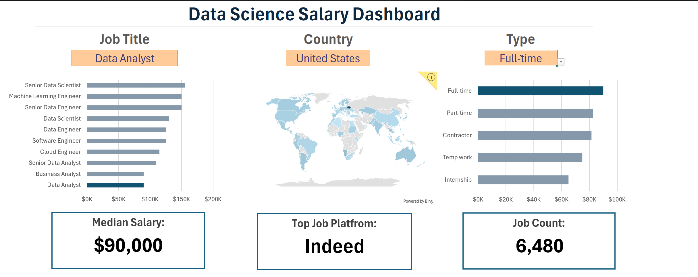

# 📊 Data Science Salary Dashboard

An interactive **Microsoft Excel dashboard** for analyzing salary trends across data science and related job roles.

The project analyzes **32,672 job postings** and provides salary insights based on **job title, country, and employment type**.

## 📊 Dashboard Preview



## 🚀 Features

* Interactive salary dashboard
* Dynamic filtering by:

  * Job Title
  * Country
  * Employment Type
* Median salary analysis
* Job title-wise salary comparison
* Country-wise salary analysis
* Employment-type salary comparison
* Dynamic Excel formulas
* Data validation and dropdown-based filtering
* Clean and user-friendly dashboard

## 🧹 Data Preparation

The dataset was prepared for reliable salary analysis by:

* Handling invalid and zero salary values
* Creating organized lists for job titles, countries, and employment types
* Using Excel Tables for structured data management
* Creating dynamic ranges for dashboard filters
* Using median salary to reduce the influence of extreme salary values

## 📈 Key Analysis

The dashboard can be used to answer questions such as:

* What is the median salary for a specific job role?
* How does median salary vary across countries?
* How does salary differ across employment types?
* Which data-related roles have higher salary levels?
* How does the selected job role compare across different locations?

## 🛠️ Tools & Excel Skills

* **Microsoft Excel**
* Excel Tables
* Data Validation
* Dynamic Array Functions
* `FILTER()`
* `MEDIAN()`
* `IF()`
* `SEARCH()`
* Conditional Filtering
* Data Cleaning
* Data Aggregation
* Dashboard Design
* Data Visualization

## 📁 Dataset

The dataset contains information including:

* Job Title
* Job Location
* Country
* Company
* Employment Type
* Work-from-home availability
* Yearly/Hourly Salary
* Job Posting Date
* Required Skills

## 🎯 Objective

The objective of this project is to demonstrate practical skills in:

* Excel-based data analysis
* Data cleaning and preparation
* Dynamic formulas
* Interactive dashboard development
* Salary trend analysis
* Business-oriented data interpretation

## 📂 Project Structure

```text
Salary_DashBoard/
│
├── 1_Salary_Dashboard.xlsx
├── dashboard.png
└── README.md
```

## 💡 What This Project Demonstrates

This project demonstrates how raw job-market data can be transformed into an **interactive analytical dashboard** that helps users quickly compare salary trends across different roles, locations, and employment types.

## 🔗 Project

**Data Science Salary Dashboard — Microsoft Excel**

Built as a practical data analysis project to develop and demonstrate Excel, data visualization, and business analytics skills.
